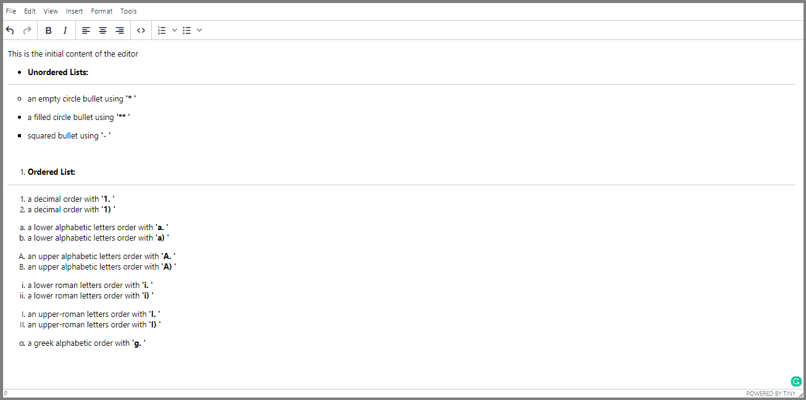

# TinyMCE Editor with React

create a rich text-editor using React and TinyMCE editor

the main goal was to use plugins to enable adding custom list items

You can try it from [here](https://ahmed-elbessfy.github.io/tinymce-text-editor/)

And here you can find all available list item types

